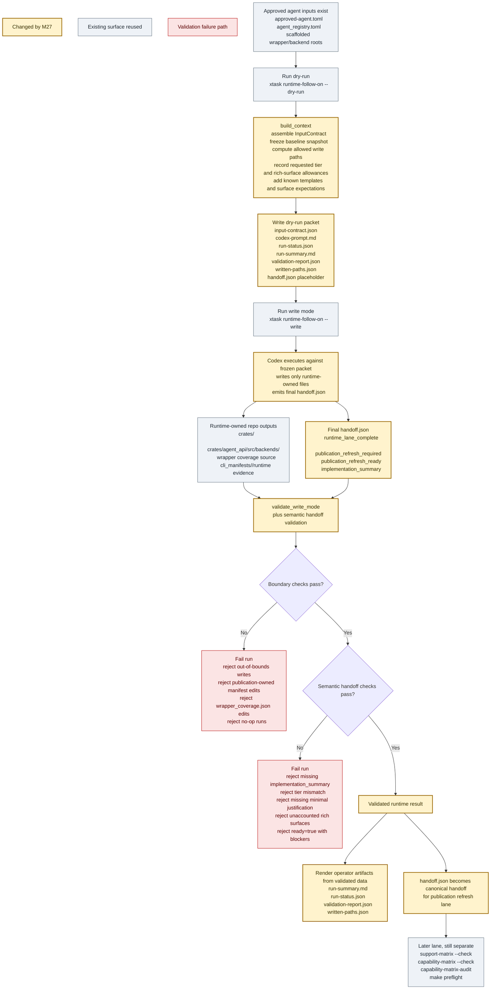
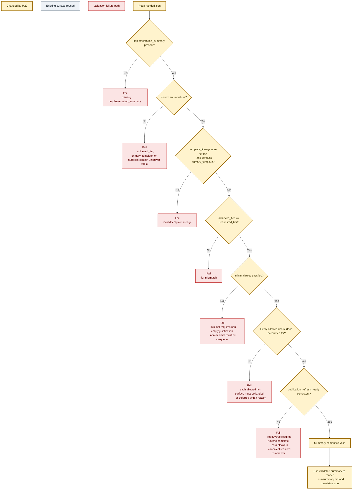

# UAA-0022 Runtime Follow-On Process Diagrams

Date: 2026-04-30
Source plan: `PLAN.md`

## End-to-End Runtime Follow-On Flow

```mermaid
flowchart TD
    LEGEND1["Changed by M27"]:::changed
    LEGEND2["Existing surface reused"]:::existing
    LEGEND3["Validation failure path"]:::failure

    A["Approved agent inputs exist
    approved-agent.toml
    agent_registry.toml
    scaffolded wrapper/backend roots"] --> B["Run dry-run
    xtask runtime-follow-on --dry-run"]

    B --> C["build_context
    assemble InputContract
    freeze baseline snapshot
    compute allowed write paths
    record requested tier and rich-surface allowances
    add known templates and surface expectations"]:::changed

    C --> D["Write dry-run packet
    input-contract.json
    codex-prompt.md
    run-status.json
    run-summary.md
    validation-report.json
    written-paths.json
    handoff.json placeholder"]:::changed

    D --> E["Run write mode
    xtask runtime-follow-on --write"]

    E --> F["Codex executes against frozen packet
    writes only runtime-owned files
    emits final handoff.json"]:::changed

    F --> G["Runtime-owned repo outputs
    crates/<agent_id>
    crates/agent_api/src/backends/<agent_id>
    wrapper coverage source
    cli_manifests/<agent_id>/runtime evidence"]

    F --> H["Final handoff.json
    runtime_lane_complete
    publication_refresh_required
    publication_refresh_ready
    implementation_summary"]:::changed

    G --> I["validate_write_mode
    plus semantic handoff validation"]:::changed
    H --> I

    I --> J{"Boundary checks pass?"}
    J -->|No| X["Fail run
    reject out-of-bounds writes
    reject publication-owned manifest edits
    reject wrapper_coverage.json edits
    reject no-op runs"]:::failure
    J -->|Yes| K{"Semantic handoff checks pass?"}

    K -->|No| Y["Fail run
    reject missing implementation_summary
    reject tier mismatch
    reject missing minimal justification
    reject unaccounted rich surfaces
    reject ready=true with blockers"]:::failure
    K -->|Yes| L["Validated runtime result"]:::changed

    L --> M["Render operator artifacts from validated data
    run-summary.md
    run-status.json
    validation-report.json
    written-paths.json"]:::changed

    L --> N["handoff.json becomes canonical handoff
    for publication refresh lane"]:::changed

    N --> O["Later lane, still separate
    support-matrix --check
    capability-matrix --check
    capability-matrix-audit
    make preflight"]

    classDef changed fill:#fff3cd,stroke:#9a6700,stroke-width:2px,color:#3b2f00;
    classDef existing fill:#eef2f7,stroke:#5b6b7a,color:#1f2933;
    classDef failure fill:#fbe4e4,stroke:#b30000,color:#5c0000;

    class A,B,E,G,O existing;
```

## `implementation_summary` Validation Flow

```mermaid
flowchart TD
    LEGEND1["Changed by M27"]:::changed
    LEGEND2["Existing surface reused"]:::existing
    LEGEND3["Validation failure path"]:::failure

    A["Read handoff.json"]:::changed --> B{"implementation_summary present?"}:::changed
    B -->|No| X1["Fail
    missing implementation_summary"]:::failure
    B -->|Yes| C{"Known enum values?"}:::changed

    C -->|No| X2["Fail
    achieved_tier, primary_template, or surfaces contain unknown value"]:::failure
    C -->|Yes| D{"template_lineage non-empty
    and contains primary_template?"}:::changed

    D -->|No| X3["Fail
    invalid template lineage"]:::failure
    D -->|Yes| E{"achieved_tier == requested_tier?"}:::changed

    E -->|No| X4["Fail
    tier mismatch"]:::failure
    E -->|Yes| F{"minimal rules satisfied?"}:::changed

    F -->|No| X5["Fail
    minimal requires non-empty justification
    non-minimal must not carry one"]:::failure
    F -->|Yes| G{"Every allowed rich surface accounted for?"}:::changed

    G -->|No| X6["Fail
    each allowed rich surface must be landed
    or deferred with a reason"]:::failure
    G -->|Yes| H{"publication_refresh_ready consistent?"}:::changed

    H -->|No| X7["Fail
    ready=true requires runtime complete
    zero blockers
    canonical required commands"]:::failure
    H -->|Yes| I["Summary semantics valid"]:::changed

    I --> J["Use validated summary to render
    run-summary.md and run-status.json"]:::changed

    classDef changed fill:#fff3cd,stroke:#9a6700,stroke-width:2px,color:#3b2f00;
    classDef existing fill:#eef2f7,stroke:#5b6b7a,color:#1f2933;
    classDef failure fill:#fbe4e4,stroke:#b30000,color:#5c0000;
```
