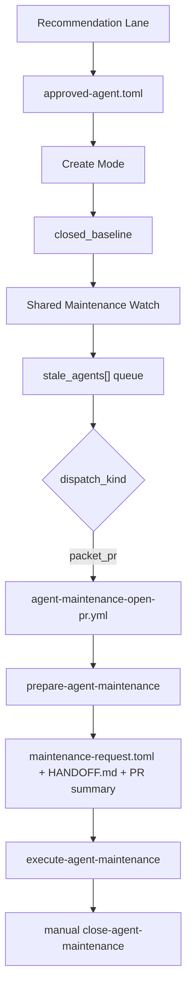
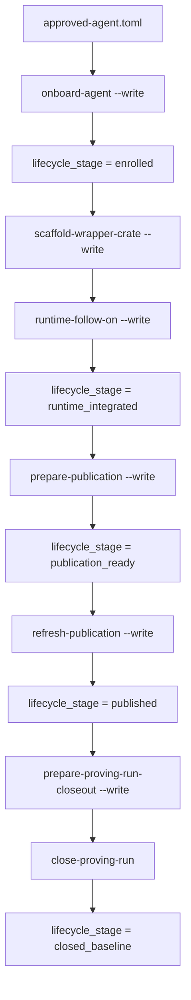
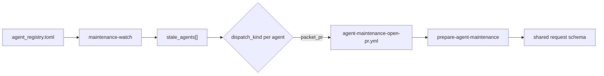
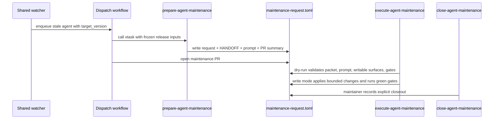
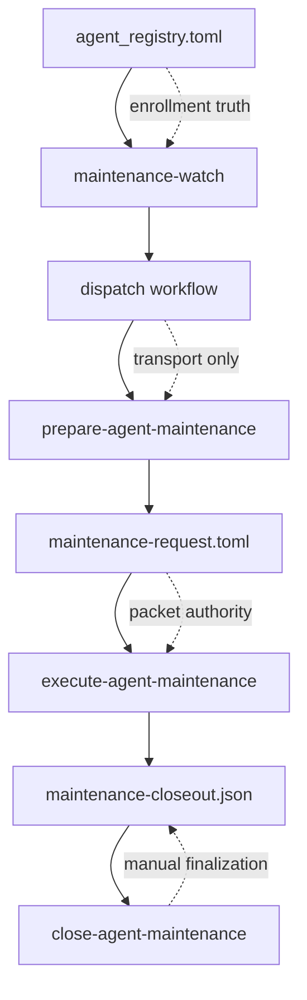
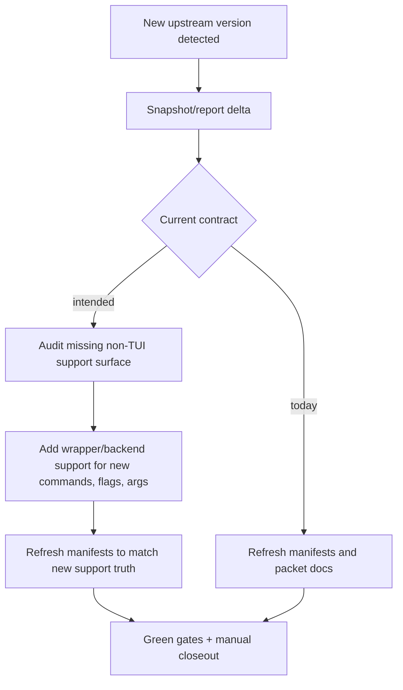
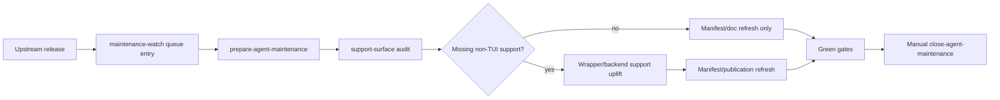

# CLI Agent Onboarding Factory Workflow Atlas

This document is the visual companion to `docs/cli-agent-onboarding-factory-operator-guide.md`.

Use the operator guide for exact commands and ordered procedure.
Use this atlas to understand the whole machine, the ownership boundaries, and where the current
maintenance contract still falls short of intended product behavior.

For the frozen shared maintenance contract, see:

`docs/specs/maintenance-request-contract-v1.md`
`docs/specs/agent-registry-contract.md`
`docs/specs/unified-agent-api/non-tui-support-debt.md`

It does not replace the normative contracts in `docs/specs/**` or the onboarding charter in
`docs/specs/cli-agent-onboarding-charter.md`.

## Truth boundaries

| Surface | Authority | What it owns |
| --- | --- | --- |
| `docs/specs/**` and `docs/specs/cli-agent-onboarding-charter.md` | Normative | contract rules, enrollment requirements, maintenance packet schema, lifecycle invariants |
| `docs/cli-agent-onboarding-factory-operator-guide.md` | Operator procedure | exact commands, ordered create-mode and maintenance-mode steps |
| `docs/cli-agent-onboarding-factory-workflow-atlas.md` | Visual system map | multi-resolution workflow diagrams, ownership boundaries, current-state versus intended-state flow framing |
| `crates/xtask/data/agent_registry.toml` | Committed control plane | enrolled agents, release-watch enrollment, dispatch kind, upstream metadata |
| `docs/agents/lifecycle/<pack>/governance/lifecycle-state.json` | Committed lifecycle state | create-mode stage, evidence continuity, next legal command |
| `docs/agents/lifecycle/<agent_id>-maintenance/governance/maintenance-request.toml` | Frozen maintenance packet | prepared request truth for one automated maintenance run |

## Read this first

The current repo already has one generic maintenance watcher.

The maintenance success contract now lives in the normative specs above.

That distinction still matters:

- workflows own transport only
- packet truth owns the support-surface audit
- relay truth owns validation, bounded writes, and gates
- manual closeout remains explicit

## L0 Factory Overview

This is the 30-second picture for the whole repo-owned factory.

### What this means

- The recommendation lane ends in one approved onboarding artifact.
- Create mode owns enrollment, wrapper scaffolding, runtime follow-on, publication, and proving-run
  closeout.
- Once an agent reaches a committed maintenance-ready baseline, the shared maintenance watcher owns
  stale release detection.
- Enrolled automated maintenance now converges on shared `packet_pr` transport and one shared
  automated maintenance request shape.

## L1 Create-Mode Lifecycle

This is the lifecycle-stage view. It focuses on which command is allowed to advance the committed
 lifecycle record.

### Ownership notes

- `onboard-agent` enrolls control-plane truth. It does not create the wrapper crate.
- `scaffold-wrapper-crate` owns only the wrapper crate shell under the registry-owned `crate_path`.
- `runtime-follow-on` owns the bounded runtime implementation lane and runtime evidence handoff.
- `prepare-publication` records the committed publication handoff.
- `refresh-publication` is the only publication consumer.
- `close-proving-run` is the final create-mode closeout and the point where maintenance readiness
  settlement becomes part of committed lifecycle truth.

## L1 Shared Maintenance Watch Topology

This is the release-watch topology. It shows how one shared detector can fan out to multiple
 enrolled agents without inventing a second enrollment inventory.

### Current committed examples

| Agent | Dispatch kind | Opening workflow | Status |
| --- | --- | --- | --- |
| `codex` | `packet_pr` | `agent-maintenance-open-pr.yml` | shared enrolled transport |
| `claude_code` | `packet_pr` | `agent-maintenance-open-pr.yml` | shared enrolled transport |
| `opencode` | `packet_pr` | `agent-maintenance-open-pr.yml` | shared enrolled transport |

### Steady-state direction

`opencode` is not just another enrolled example.

Its successful `packet_pr` proving run established the direction the maintenance factory is
supposed to converge toward:

- the shared watcher detects stale enrolled agents
- dispatch opens the shared packet PR lane
- `prepare-agent-maintenance` writes one generic automated packet
- `execute-agent-maintenance` owns the bounded local relay
- `close-agent-maintenance` remains explicit and manual

On that model, the `codex` and `claude_code` per-agent snapshot workflows are transitional
transport surfaces, not the intended permanent steady state.

### What stays generic

- stale-agent detection comes from one shared watcher
- dispatch metadata comes from the registry
- prepared request schema stays shared
- relay execution contract stays packet-owned

### What is allowed to differ

- upstream source type
- dispatch transport
- exact writable surfaces
- exact read-only packet inputs
- exact ordered commands and green gates

## L2 Automated Upstream-Release Execution

This is the current machine truth for automated maintenance after the watcher has decided that an
 enrolled agent is stale.

### Transport versus execution

This is the most important architectural split in maintenance mode.

#### Transport owns

- upstream acquisition
- calling `prepare-agent-maintenance`
- opening or refreshing the PR

#### Prepared packet owns

- frozen request envelope
- detected release facts
- writable surfaces
- read-only inputs
- ordered commands
- green gates
- replay and recovery notes

#### Relay owns

- validating the prepared packet
- validating local execution-host readiness
- enforcing the write envelope
- running ordered commands and green gates
- stopping before closeout

#### Manual closeout owns

- final maintainer review step
- explicit recording of maintenance closeout
- lifecycle drift clearing where applicable

## L2 Maintenance Ownership Model

This is the same system as a responsibility map instead of a timeline.

### Manual drift lane versus automated release-watch lane

| Lane | Entry artifact | Main executor | Purpose |
| --- | --- | --- | --- |
| Manual drift lane | maintainer-authored `maintenance-request.toml` | `refresh-agent` | refresh packet docs and explicitly requested maintenance-owned publication surfaces |
| Automated upstream-release lane | prepared v2 `maintenance-request.toml` | `execute-agent-maintenance` | bounded relay execution against a frozen automated request contract |

`refresh-agent` is not the runtime support-uplift executor. It is the packet and publication
refresh seam for manual maintenance lanes, including the library-only validated-runtime projection at `crates/agent_api/src/runtime_support_data.rs` when support publication truth is refreshed.

`execute-agent-maintenance` is the intended automation relay surface for prepared automated
upstream-release requests.

## L3 Current Gap: Maintenance Still Behaves Like Artifact Refresh

This is the current mismatch between machine capability and intended product behavior.

### Support-audit truth

Maintenance for enrolled agents must now be able to:

- detect newly available non-TUI surface in upstream CLI snapshots
- compare that surface against current wrapper coverage, backend support, published support truth,
  and the committed debt inventory
- land bounded support uplift in `crates/<agent>/**` and `crates/agent_api/**`
- refresh manifests and publication surfaces so committed support truth matches what was added
- fail closed or record one concrete allowed deferral when uplift cannot truthfully land in the
  current run

### What is explicitly out of scope

The intended maintenance uplift is for non-TUI surfaces only.

This does not imply:

- broad TUI automation support
- arbitrary interactive UX parity
- a second unbounded implementation lane hidden inside maintenance

The missing seam is narrower than that. It is support uplift for newly available automatable
surface.

## L3 Shared Maintenance Shape

This is the current shared decision point encoded by the frozen packet contract.

The point is not to make maintenance huge.

The point is to stop treating "new upstream version exists" and "repo support truth should expand"
as unrelated events.

## Artifact Glossary

| Artifact | Meaning | Primary writer |
| --- | --- | --- |
| `docs/agents/lifecycle/<prefix>/governance/approved-agent.toml` | approved create-lane input | recommendation promotion, then maintainer approval |
| `docs/agents/lifecycle/<prefix>/governance/lifecycle-state.json` | committed create-mode lifecycle truth | create-lane lifecycle commands |
| `docs/agents/lifecycle/<prefix>/governance/publication-ready.json` | committed publication handoff | `prepare-publication --write` |
| `docs/agents/lifecycle/<prefix>/governance/proving-run-closeout.json` | create-mode closeout artifact | `prepare-proving-run-closeout --write`, then maintainer, then `close-proving-run` |
| `docs/agents/lifecycle/<agent_id>-maintenance/governance/maintenance-request.toml` | frozen automated or manual maintenance request, including support-surface audit truth | maintainer or `prepare-agent-maintenance --write` |
| `docs/agents/lifecycle/<agent_id>-maintenance/HANDOFF.md` | canonical execution contract prose for automated maintenance | maintenance packet renderer |
| `docs/agents/lifecycle/<agent_id>-maintenance/governance/maintenance-closeout.json` | maintenance closeout artifact | maintainer, then `close-agent-maintenance` |
| `docs/agents/.uaa-temp/runtime-follow-on/runs/<run_id>/` | scratch runtime evidence | `runtime-follow-on` |
| `docs/agents/.uaa-temp/agent-maintenance/runs/<run_id>/` | scratch relay evidence | `execute-agent-maintenance` |

## How to use this doc with the operator guide

Use this atlas first when you need to answer:

- where am I in the factory?
- which artifact is authoritative here?
- is this a transport problem, a packet problem, or a relay problem?
- is this create mode or maintenance mode?

Then switch to the operator guide when you need:

- the exact command to run
- the exact expected next command
- the precise green gate
- the exact packet root or closeout artifact path

## Sources behind these diagrams

- `docs/cli-agent-onboarding-factory-operator-guide.md`
- `docs/specs/agent-registry-contract.md`
- `docs/specs/maintenance-request-contract-v1.md`
- `docs/specs/cli-agent-onboarding-charter.md`
- `.github/workflows/agent-maintenance-release-watch.yml`
- `.github/workflows/agent-maintenance-open-pr.yml`
- `.github/workflows/codex-cli-update-snapshot.yml`
- `.github/workflows/claude-code-update-snapshot.yml`
- `crates/xtask/src/agent_maintenance/watch.rs`
- `crates/xtask/src/agent_maintenance/prepare.rs`
- `crates/xtask/src/agent_maintenance/execute/workflow.rs`
- `crates/xtask/src/agent_maintenance/refresh.rs`
- `crates/xtask/src/approval_artifact/maintenance.rs`

If the atlas and the operator guide ever drift, treat the operator guide and `docs/specs/**` as
the contract truth and update this atlas to match.
