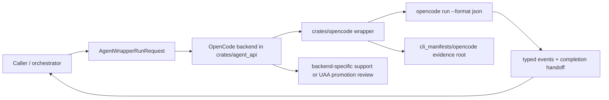
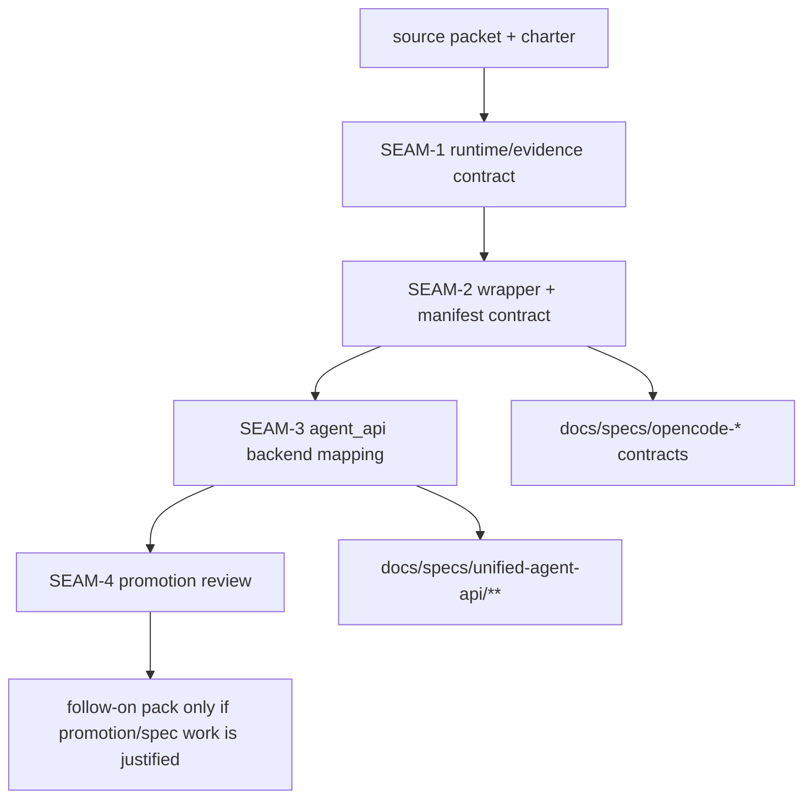
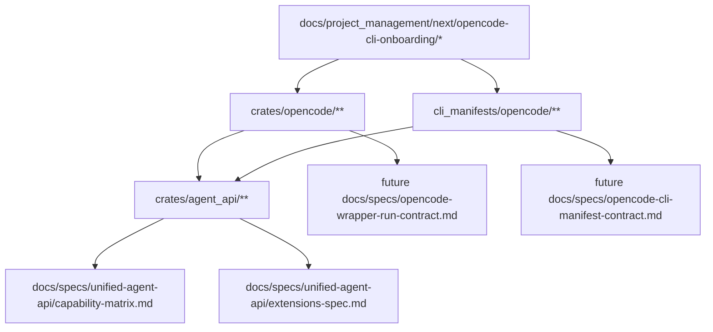

# Review Surfaces - OpenCode CLI onboarding

These diagrams orient the pack. They show the expected product/work shape that is intended to
land. They do not, by themselves, satisfy seam-local pre-exec review.

Active and next seams still require seam-local `review.md` artifacts later.

## R1 - High-level onboarding workflow

## R2 - Contract and dependency flow

## R3 - Touch surface map (repo)

