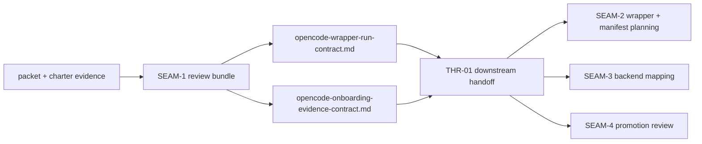
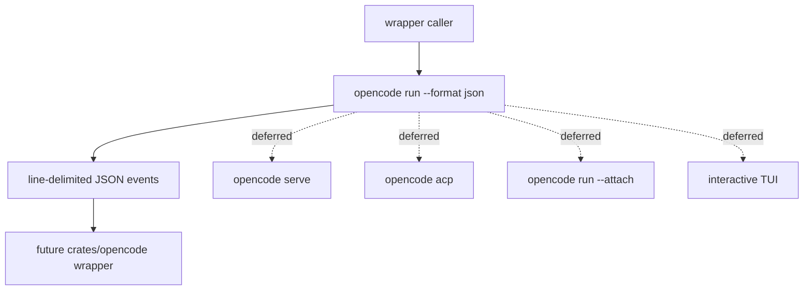

# Review Bundle - SEAM-1 Runtime surface and evidence lock

This artifact feeds `gates.pre_exec.review`.
`../../review_surfaces.md` is pack orientation only.

## Falsification questions

- Can downstream wrapper or backend work still widen v1 to `serve`, `acp`, `run --attach`, or
  interactive TUI behavior without explicitly reopening the seam?
- Does any part of the runtime or evidence handoff still depend on packet prose instead of concrete
  canonical docs under `docs/specs/**`?
- Could downstream work mistake provider-specific auth failures for wrapper semantics instead of a
  bounded evidence and reopen posture?

## R1 - Runtime lock and downstream handoff

## R2 - Canonical v1 boundary

## Likely mismatch hotspots

- Canonical-doc drift: planning text could stay more specific or more permissive than the new
  `docs/specs/**` baselines.
- Evidence drift: live maintainer smoke could be treated as sufficient for long-term support
  publication without the replay and fixture constraints captured in the evidence contract.
- Scope drift: helper surfaces could re-enter through later wrapper planning unless the deferred
  policy and reopen triggers remain explicit.

## Pre-exec findings

- No open pre-exec findings remain after this refresh.
- `REM-001` is closed by the explicit fixture-versus-live-smoke rules and reopen triggers now
  recorded in `docs/specs/opencode-onboarding-evidence-contract.md`.
- `REM-002` is closed by the explicit v1 boundary and deferred-surface rules now recorded in
  `docs/specs/opencode-wrapper-run-contract.md`.

## Pre-exec gate disposition

- **Review gate**: passed
- **Contract gate concerns**: none; the owned runtime and evidence baselines now live in
  `docs/specs/opencode-wrapper-run-contract.md` and
  `docs/specs/opencode-onboarding-evidence-contract.md`.
- **Revalidation prerequisites**: satisfied by the packet's dated maintainer-smoke addendum and
  the absence of contradictory upstream closeout because `SEAM-1` is the active producer seam.
- **Opened remediations**: none

## Planned seam-exit gate focus

- **What must be true before downstream promotion is legal**: the landed seam must publish `C-01`
  and `C-02`, confirm that helper surfaces stayed deferred, and record whether any stale trigger
  now applies to `SEAM-2`, `SEAM-3`, or `SEAM-4`.
- **Which outbound contracts/threads matter most**: `C-01`, `C-02`, and `THR-01`
- **Which review-surface deltas would force downstream revalidation**: any change to the canonical
  run surface, any weakening of deterministic replay expectations, or any promotion of helper
  surfaces into the v1 wrapper boundary
