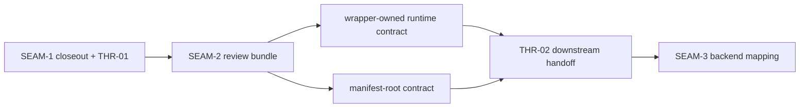
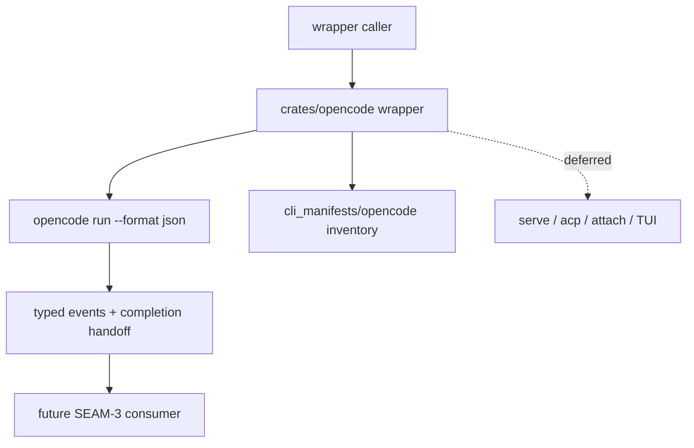

# Review Bundle - SEAM-2 Wrapper crate and manifest foundation

This artifact feeds `gates.pre_exec.review`.
`../../review_surfaces.md` is pack orientation only.

## Falsification questions

- Can wrapper planning still widen scope back into `serve`, `acp`, `run --attach`, or direct
  interactive TUI behavior without explicitly reopening the landed `SEAM-1` contract?
- Could backend mapping or support publication still invent wrapper semantics because the
  event/completion/redaction boundary remains ambiguous at the wrapper seam?
- Can manifest support claims land without one concrete `cli_manifests/opencode/` inventory,
  pointer, and evidence layout that matches existing repo norms?

## R1 - Wrapper and manifest handoff

## R2 - Wrapper-owned boundary

## Likely mismatch hotspots

- Wrapper-boundary drift: spawn, stream, completion, or redaction ownership could leak into the
  backend seam if the wrapper contract stays too vague.
- Manifest drift: `cli_manifests/opencode/` could diverge from current repo patterns if artifact,
  pointer, or report rules stay implicit.
- Validation drift: provider-backed smoke could become the only usable proof path unless offline
  parser, replay, and fake-binary posture stay explicit.

## Pre-exec findings

- No open pre-exec findings remain after this refresh.
- `THR-01` is now revalidated against `governance/seam-1-closeout.md` and the canonical runtime
  and evidence contracts.
- No blocking remediation is required before `SEAM-2` executes its wrapper/manifest planning work.

## Pre-exec gate disposition

- **Review gate**: passed
- **Contract gate concerns**: none; `S00` gives `SEAM-2` dedicated contract-definition work for
  the wrapper-owned boundary and manifest inventory without waiting on post-exec publication.
- **Revalidation prerequisites**: satisfied by the landed `SEAM-1` closeout, resolved
  remediations, and the absence of contradictory upstream stale triggers.
- **Opened remediations**: none

## Planned seam-exit gate focus

- **What must be true before downstream promotion is legal**: `SEAM-2` closeout must publish
  `C-03`, `C-04`, and `THR-02`, and it must prove helper surfaces stayed out of the wrapper seam.
- **Which outbound contracts/threads matter most**: `C-03`, `C-04`, and `THR-02`
- **Which review-surface deltas would force downstream revalidation**: any change to wrapper event
  ownership, manifest inventory shape, or fixture/fake-binary posture
