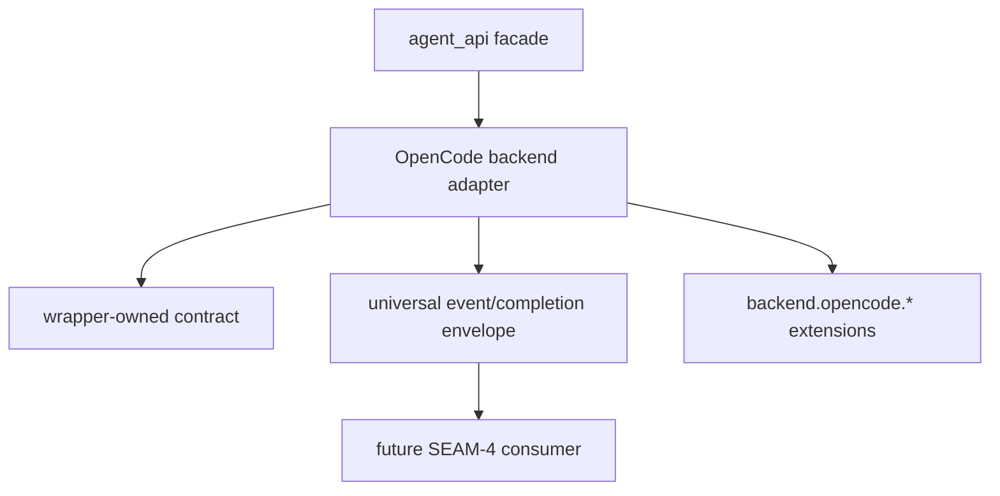

# Review Bundle - SEAM-3 agent_api backend mapping

This artifact feeds `gates.pre_exec.review`.
`../../review_surfaces.md` is pack orientation only.

## Falsification questions

- Can backend planning still leak raw OpenCode payloads, provider diagnostics, or wrapper-private
  details into the universal envelope because the wrapper handoff remains too vague?
- Could capability or extension advertisement still overclaim support because the backend-owned
  contract does not fail closed on unsupported keys or unstable behavior?
- Can validation drift back to live-provider dependence because fixture, replay, fake-binary, or
  redaction posture remains ambiguous at the backend seam?

## R1 - Backend handoff

## R2 - Backend-owned boundary

## Likely mismatch hotspots

- Envelope drift: raw lines or provider-specific diagnostics could escape the backend boundary if
  the mapping contract does not keep payloads bounded and redacted.
- Advertisement drift: capability ids or extension keys could overclaim universal support if the
  backend seam does not keep unsupported or unstable behavior backend-specific.
- Validation drift: fixture-first expectations could blur into provider-backed smoke if replay and
  fake-binary posture is not concrete enough for deterministic backend tests.

## Pre-exec findings

- No open pre-exec findings remain after this refresh.
- `THR-01` and `THR-02` are now revalidated against the landed `SEAM-1` and `SEAM-2` closeouts and
  the canonical wrapper, evidence, and manifest contracts.
- No blocking remediation is required before `SEAM-3` executes its backend-planning work.

## Pre-exec gate disposition

- **Review gate**: passed
- **Contract gate concerns**: none; `S00` gives `SEAM-3` dedicated contract-definition work for
  the backend-owned mapping and extension boundary without waiting on post-exec publication.
- **Revalidation prerequisites**: satisfied by the landed `SEAM-2` closeout, published `THR-02`,
  resolved upstream remediations, and the absence of contradictory stale triggers.
- **Opened remediations**: none

## Planned seam-exit gate focus

- **What must be true before downstream promotion is legal**: `SEAM-3` closeout must publish
  `C-05`, `C-06`, and `THR-03`, and it must prove backend mapping stayed bounded by the wrapper
  contract without over-advertising universal support.
- **Which outbound contracts/threads matter most**: `C-05`, `C-06`, and `THR-03`
- **Which review-surface deltas would force downstream revalidation**: any change to backend event
  mapping, capability advertisement, extension ownership, or validation/redaction posture
