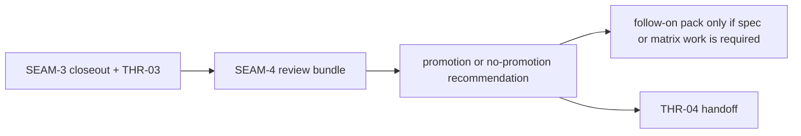
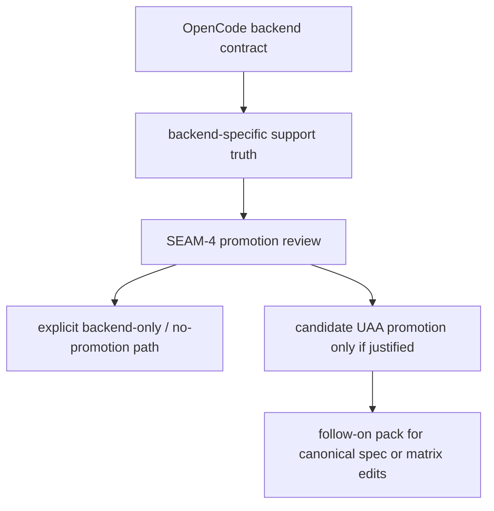

# Review Bundle - SEAM-4 UAA promotion and publication follow-on

This artifact feeds `gates.pre_exec.review`.
`../../review_surfaces.md` remains orientation only.

## Falsification questions

- Could SEAM-4 mistake concrete OpenCode backend support for justified universal promotion even
  though the evidence still comes from a single backend seam?
- Could the promotion seam leave backend-specific behavior ambiguous by failing to record an
  explicit no-promotion answer or an explicit follow-on requirement?
- Could spec or capability-matrix changes slip into the recommendation path without a separate
  approved follow-on execution pack?
- Could the capability matrix be mistaken for runtime truth instead of a generated supporting
  artifact for review only?

## R1 - Promotion-review handoff

## R2 - Backend support versus UAA promotion

## Likely mismatch hotspots

- Promotion pressure: backend-specific behavior could be mistaken for universal support simply
  because SEAM-3 made the backend contract concrete.
- Publication drift: capability-matrix or extension-registry edits could be implied without a
  separate approved follow-on execution pack.
- Evidence drift: new backend behavior or cross-backend evidence could change promotion
  eligibility after this review locks its basis.

## Pre-exec findings

- No open pre-exec findings remain after this refresh.
- `THR-03` is now revalidated against the landed `SEAM-3` closeout and the published backend
  mapping contract.
- The capability matrix remains a generated evidence artifact; it does not override backend
  contract evidence or authorize runtime promotion decisions.
- No blocking remediation is required before `SEAM-4` executes promotion-review planning work.

## Pre-exec gate disposition

- **Review gate**: passed
- **Contract gate concerns**: none; the seam-local slices make the promotion recommendation,
  no-promotion routing, and follow-on pack decision concrete without requiring spec or matrix edits
  in this seam.
- **Revalidation prerequisites**: satisfied by the landed `SEAM-3` closeout, published `THR-03`,
  and the absence of contradictory stale triggers.
- **Opened remediations**: none
- **Publication-state rule**: backend support and universal promotion remain separate states; when
  cross-backend evidence is missing, the review must resolve to explicit no-promotion rather than
  implied approval.

## Planned seam-exit gate focus

- **What must be true before downstream promotion is legal**: `SEAM-4` closeout must publish one
  explicit backend-support versus UAA-promotion recommendation, one explicit follow-on-pack answer,
  and `THR-04` without leaving backend-specific behavior ambiguous.
- **Which outbound contracts/threads matter most**: `C-07` and `THR-04`
- **Which review-surface deltas would force downstream revalidation**: any change to backend
  evidence, capability advertisement, extension ownership, or universal promotion rules
