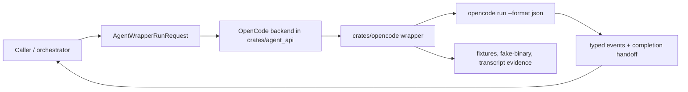
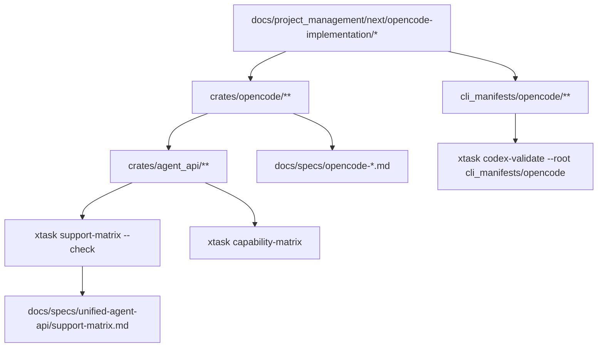
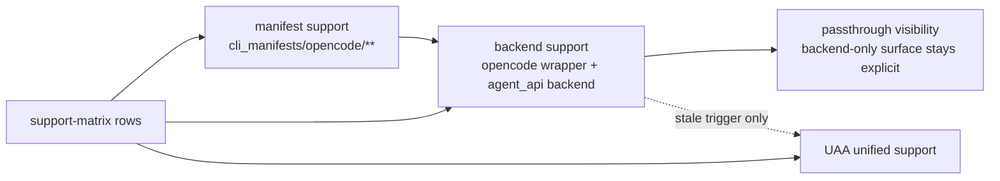
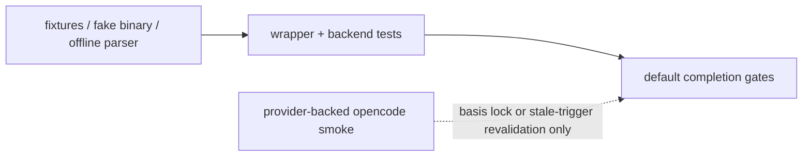

# Review Surfaces - OpenCode implementation

These diagrams orient the pack. They show the actual product and repository work shape expected to
land. They do not, by themselves, satisfy seam-local pre-exec review.

Active and next seams still require seam-local `review.md` artifacts later.

## R1 - End-to-end OpenCode run workflow

## R2 - Repo touch surface and validation flow

## R3 - Support-layer publication boundary

## R4 - Deterministic versus live evidence boundary

