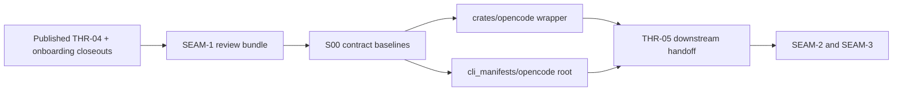
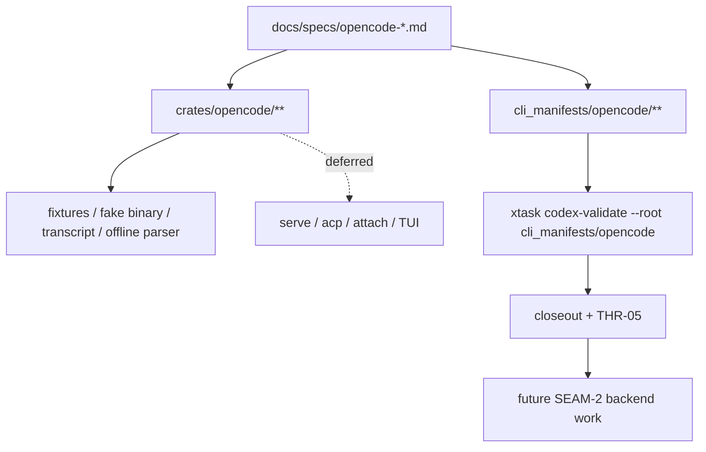

# Review Bundle - SEAM-1 Wrapper crate and manifest foundation

This artifact feeds `gates.pre_exec.review`.
`../../review_surfaces.md` is pack orientation only.

## Falsification questions

- Can the wrapper crate still overreach into backend mapping or helper-surface recovery instead of
  staying bounded to the canonical `run --format json` contract?
- Could `cli_manifests/opencode/` land without one concrete inventory, pointer, validator, and
  report model that matches current repo roots?
- Can deterministic replay, fake-binary, transcript, or offline-parser proof stay ambiguous enough
  that `SEAM-2` or `SEAM-3` must depend on live provider-backed smoke?

## R1 - Foundation handoff flow

## R2 - Repo implementation boundary

## Likely mismatch hotspots

- Workspace-boundary drift: wrapper ownership could leak into `crates/agent_api/` or helper
  surfaces if crate boundaries stay too implicit.
- Manifest-root drift: inventory, pointers, reports, or validator posture could diverge from
  existing repo patterns if the root is created ad hoc.
- Evidence drift: transcript, fake-binary, and offline-parser posture could collapse back into
  live smoke if deterministic proof paths are not explicit in the landing plan.

## Pre-exec findings

- No open pre-exec findings remain after this refresh.
- `THR-04` is now revalidated against the landed onboarding closeouts and the published
  recommendation that OpenCode work remains backend-support scoped under the current evidence
  basis.
- No blocking remediation is required before `SEAM-1` executes the wrapper and manifest foundation
  work.

## Pre-exec gate disposition

- **Review gate**: passed
- **Contract gate concerns**: none; `S00` makes the workspace, wrapper, manifest-root, and
  validator baselines concrete enough to implement without waiting on this seam's own closeout.
- **Revalidation prerequisites**: satisfied by the landed onboarding closeouts, published
  `THR-04`, and the absence of contradictory remediations or stale-trigger evidence.
- **Opened remediations**: none

## Planned seam-exit gate focus

- **What must be true before downstream promotion is legal**: `SEAM-1` closeout must show that the
  wrapper crate, manifest root, deterministic-evidence posture, and OpenCode-specific root
  validation landed together and that `THR-05` is explicitly published.
- **Which outbound contracts/threads matter most**: `C-01`, `C-02`, and `THR-05`
- **Which review-surface deltas would force downstream revalidation**: any change to wrapper
  event/completion ownership, accepted control handling, manifest-root inventory shape, or
  deterministic replay evidence posture
