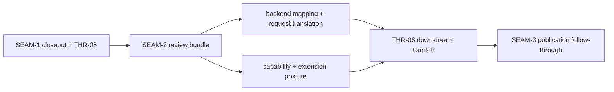
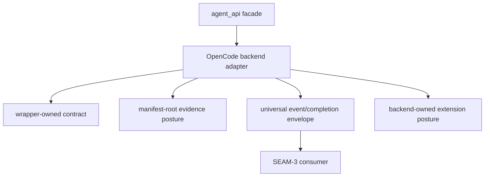

# Review Bundle - SEAM-2 agent_api OpenCode backend

This artifact feeds `gates.pre_exec.review`.
`../../review_surfaces.md` is pack orientation only.

## Falsification questions

- Can backend planning still leak raw OpenCode payloads, provider diagnostics, or wrapper-private
  details because the `THR-05` handoff is too vague?
- Could capability or extension advertisement still overclaim support because the backend-owned
  contract does not fail closed on unsupported or unstable keys?
- Can backend validation drift back to live-provider dependence because fixture, replay,
  fake-binary, or redaction posture remains ambiguous?

## R1 - Backend handoff

## R2 - Backend-owned boundary

## Likely mismatch hotspots

- Envelope drift: raw lines or provider-specific diagnostics could escape the backend boundary if
  mapping and redaction rules are not explicit.
- Advertisement drift: capability ids or extension keys could overclaim support if the backend seam
  does not keep unsupported or unstable behavior fail closed.
- Validation drift: fixture-first expectations could blur into provider-backed smoke if replay and
  fake-binary posture is not concrete enough for deterministic backend tests.

## Pre-exec findings

- No open pre-exec findings remain after this refresh.
- `THR-04` and `THR-05` are now current inputs grounded in the landed `SEAM-1` closeout and the
  canonical wrapper, evidence, and manifest contracts.
- No blocking remediation is required before `SEAM-2` executes its backend implementation work.

## Pre-exec gate disposition

- **Review gate**: passed
- **Contract gate concerns**: none; `S00` gives `SEAM-2` a dedicated contract-definition and
  registration boundary before code slices begin.
- **Revalidation prerequisites**: satisfied by the landed `SEAM-1` closeout, the revalidated
  `THR-05` handoff, and the absence of contradictory stale triggers.
- **Opened remediations**: none

## Planned seam-exit gate focus

- **What must be true before downstream publication is legal**: `SEAM-2` closeout must publish
  `C-03` and `THR-06`, and it must prove backend mapping stayed bounded by the wrapper and
  manifest handoff without over-advertising support.
- **Which outbound contracts/threads matter most**: `C-03` and `THR-06`
- **Which review-surface deltas would force downstream revalidation**: any change to request or
  event mapping, capability advertisement, extension ownership, validation posture, or redaction
  behavior
