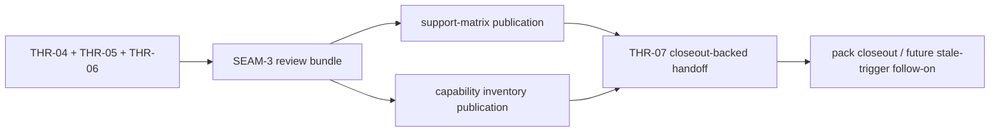
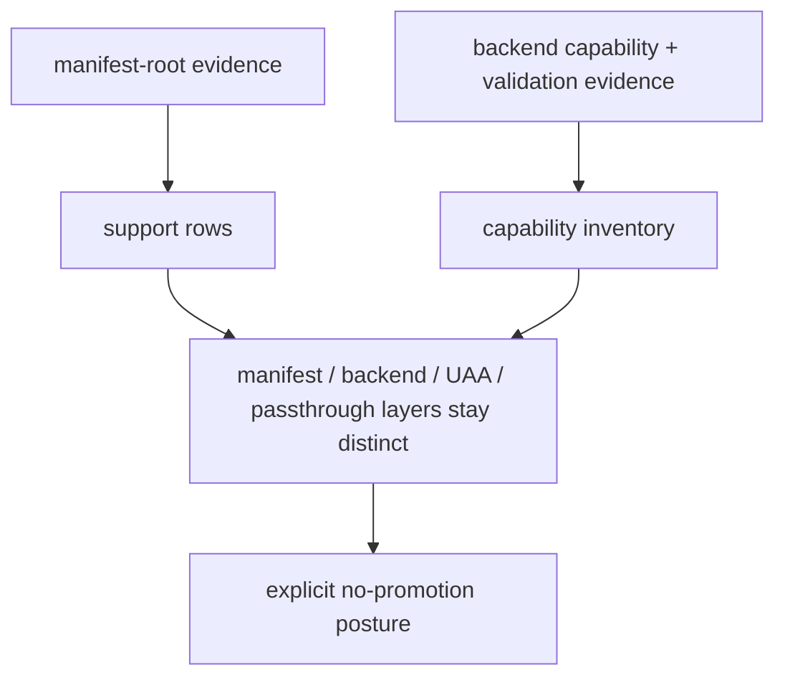

# Review Bundle - SEAM-3 backend support publication and validation follow-through

This artifact feeds `gates.pre_exec.review`.
`../../review_surfaces.md` is pack orientation only.

## Falsification questions

- Can support publication still collapse manifest support, backend support, UAA unified support,
  and passthrough visibility into one OpenCode claim because the publication boundary is too vague?
- Could capability inventory updates still be misread as universal support because the backend and
  publication outputs are not separated concretely enough?
- Can validation drift back to ad hoc or live-provider-backed inference because committed support
  outputs and root checks are not the explicit done-ness path?

## R1 - Publication handoff flow

## R2 - Support-layer boundary

## Likely mismatch hotspots

- Layer-collapse drift: support rows or notes could blur backend support into UAA support if the
  four-layer model is not carried through the committed outputs.
- Inventory drift: capability-matrix changes could imply broader OpenCode support than the landed
  backend actually advertises if backend and publication semantics diverge.
- Validation drift: publication checks could rely on inferred or live state instead of committed
  support outputs and OpenCode root validation.

## Pre-exec findings

- No open pre-exec findings remain after this refresh.
- `THR-04`, `THR-05`, and `THR-06` are now current inputs grounded in the landed `SEAM-1` and
  `SEAM-2` closeouts and their explicit downstream handoffs.
- No blocking remediation is required before `SEAM-3` executes its bounded publication work.

## Pre-exec gate disposition

- **Review gate**: passed
- **Contract gate concerns**: none; `S00` makes the support-layer boundary, publication ownership,
  and validation posture concrete enough to implement without waiting on this seam's own closeout.
- **Revalidation prerequisites**: satisfied by the landed `SEAM-1` and `SEAM-2` closeouts, the
  revalidated inbound threads, and the absence of contradictory stale-trigger evidence.
- **Opened remediations**: none

## Planned seam-exit gate focus

- **What must be true before pack closeout is legal**: `SEAM-3` closeout must publish `C-04` and
  `THR-07`, and it must prove that support publication and capability inventory reflect landed
  OpenCode evidence without implying UAA promotion.
- **Which outbound contracts/threads matter most**: `C-04` and `THR-07`
- **Which review-surface deltas would force downstream revalidation**: any change to support-layer
  semantics, capability-inventory meaning, committed root/backend enumeration, passthrough
  visibility posture, or explicit non-promotion wording
