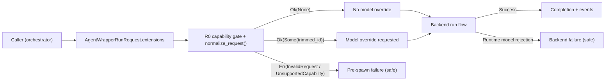
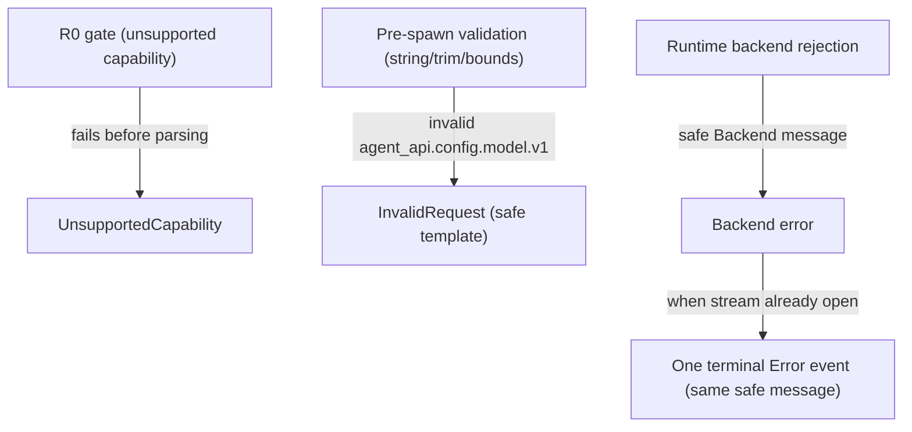
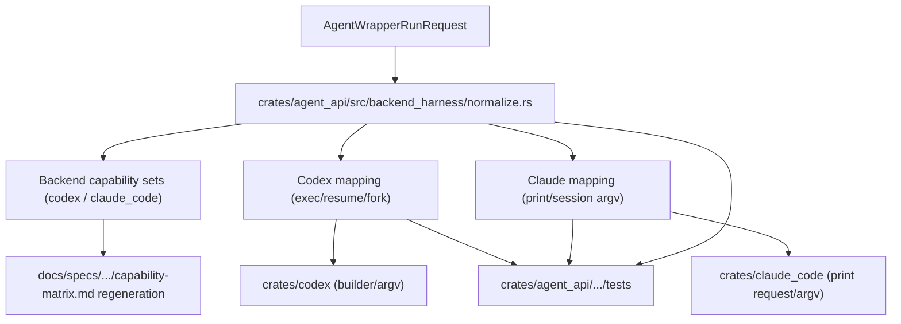

# Review Surfaces - Universal model selection (`agent_api.config.model.v1`)

These diagrams orient the pack. They show the expected product/work shape that is intended to land.
They do not, by themselves, satisfy seam-local pre-exec review.

## R1 - High-level workflow

## R2 - Validation and error surfaces

## R3 - Touch surface map (repo)

