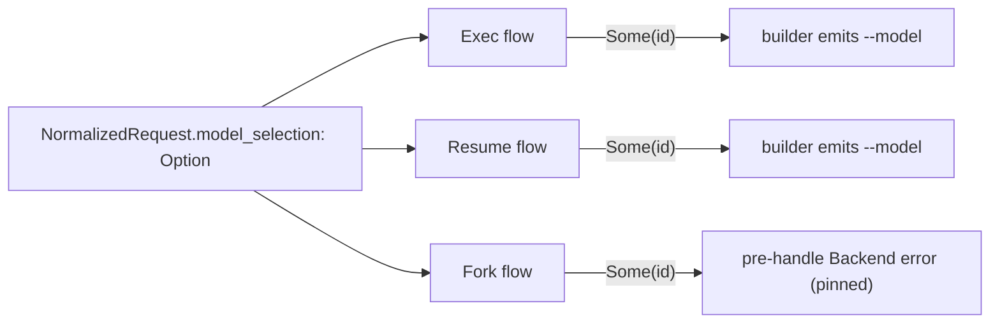

# Review Bundle - SEAM-3 Codex backend mapping

This artifact feeds `gates.pre_exec.review`.
`../../review_surfaces.md` is pack orientation only.

## Falsification questions

- Can Codex still observe a raw extension payload (or re-trim) instead of consuming only the typed `Option<String>` from SEAM-2?
- Can exec/resume emit `--model` in the wrong place relative to wrapper overrides and capability-guarded `--add-dir` flags?
- Can fork flows with model override still reach `thread/list` or any other app-server request before failing?

## R1 - Codex run flows (exec/resume/fork)

## Likely mismatch hotspots

- "Exactly one `--model`" drift if both harness and builder attempt to emit.
- "Ordering" drift if new argv tokens are inserted to the left of `--model`.
- "Fork pre-handle" drift if selector resolution triggers app-server calls before the rejection.

## Pre-exec findings

None yet.

## Pre-exec gate disposition

- **Review gate**: pending
- **Contract gate concerns**: codex ordering + fork rejection contract must remain deterministic and testable.
- **Revalidation prerequisites**: SEAM-2 publishes `THR-02` (typed helper handoff) and SEAM-1 publishes `THR-01`.
- **Opened remediations**: none

## Planned seam-exit gate focus

- **What must be true before downstream promotion is legal**: mapping behavior and tests exist, and fork rejection + runtime rejection parity is recorded in closeout.
- **Which outbound contracts/threads matter most**: `C-06` / `THR-04`.
- **Which review-surface deltas would force downstream revalidation**: any change to builder ordering rules or fork transport surface.
