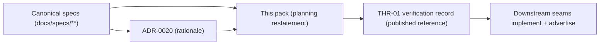
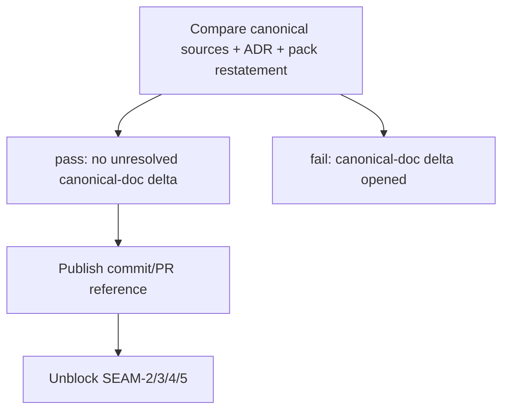

# Review Bundle - SEAM-1 Core extension key contract

This artifact feeds `gates.pre_exec.review`.
`../../review_surfaces.md` is pack orientation only.

## Falsification questions

- Can downstream seams still cite a "pass" record that is only a provisional local `git HEAD` reference?
- Can canonical sources disagree (extensions spec vs registry entry vs run protocol) without opening a blocking remediation?
- Can ADR/pack restatements drift from the canonical specs in a way that would mislead implementation seams?

## R1 - Canonical authority flow

## R2 - Evidence and gate record

## Likely mismatch hotspots

- registry entry drifts from owner spec (bucket or capability id)
- invalid-request template changes in one doc but not others
- run-protocol terminal Error event rule drifts from pack restatement

## Pre-exec findings

None yet.

## Pre-exec gate disposition

- **Review gate**: pending
- **Contract gate concerns**: ensure C-01..C-04 are concrete enough that implementation seams cannot reinterpret.
- **Revalidation prerequisites**: none (this seam produces the initial published verification record).
- **Opened remediations**: none

## Planned seam-exit gate focus

- **What must be true before downstream promotion is legal**: SEAM-1 verification record cites a commit/PR reference and any drift is resolved in canonical specs first.
- **Which outbound contracts/threads matter most**: `THR-01` and `C-01..C-04`.
- **Which review-surface deltas would force downstream revalidation**: any edit to the canonical spec sections governing v1 semantics.

