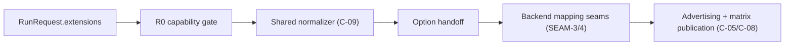
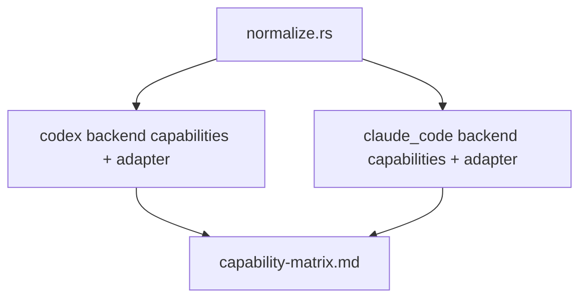

# Review Bundle - SEAM-2 Backend advertising + normalization hook

This artifact feeds `gates.pre_exec.review`.
`../../review_surfaces.md` is pack orientation only.

## Falsification questions

- Can any backend path still parse `agent_api.config.model.v1` outside `crates/agent_api/src/backend_harness/normalize.rs`?
- Can built-in capability advertising become true for a backend that still drops or rewrites an accepted model override on any exposed run flow?
- Can the capability matrix be regenerated later (after merge) without users observing drift between published docs and runtime advertising?

## R1 - Workflow / contract handoff

## R2 - Touch surface deltas

## Likely mismatch hotspots

- "R0 ordering" drift: parsing/validation moves ahead of unsupported-capability failure.
- "One raw parse site" drift: backend mapping seams add local trimming/validation.
- "Truthful publication" drift: advertising flips without matrix regeneration in the same change.

## Pre-exec findings

None yet.

## Pre-exec gate disposition

- **Review gate**: pending
- **Contract gate concerns**: ensure C-09 defines exactly-one parse site and a typed handoff; ensure advertising rules (C-05) are crisp enough to audit.
- **Revalidation prerequisites**: satisfied by SEAM-1 closeout + published THR-01 gate record.
- **Opened remediations**: none

## Planned seam-exit gate focus

- **What must be true before downstream promotion is legal**: published evidence that the shared helper exists, tests exist, and advertising/matrix posture is aligned.
- **Which outbound contracts/threads matter most**: `C-09` / `THR-02`; `C-08` / `THR-03`.
- **Which review-surface deltas would force downstream revalidation**: any helper-signature change or any advertising flip without matrix regeneration.
