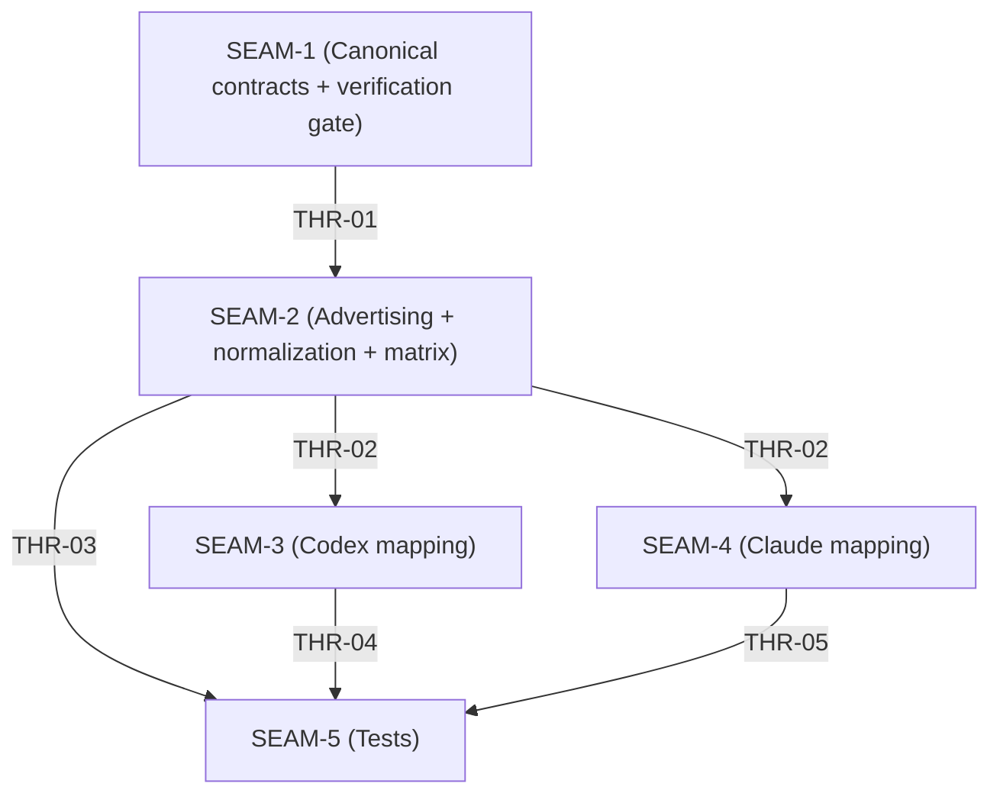

# Threading - Universal model selection (`agent_api.config.model.v1`)

This document is authoritative for:

- contract IDs and seam ownership
- thread IDs and thread states
- dependency directionality and critical path sequencing
- workstream carving

## Execution horizon summary

- Active seam: `SEAM-1`
- Next seam: `SEAM-2`
- Future seams: `SEAM-3`, `SEAM-4`, `SEAM-5`

## Contract registry

- **Contract ID**: `C-01` (legacy: `MS-C01`)
  - **Type**: config
  - **Owner seam**: `SEAM-1`
  - **Direct consumers**: `SEAM-2`, `SEAM-3`, `SEAM-4`, `SEAM-5`
  - **Derived consumers**: none
  - **Thread IDs**: `THR-01`
  - **Definition**: `agent_api.config.model.v1` is a string-valued extension key whose effective value is the caller-supplied model id after trimming leading/trailing Unicode whitespace.
  - **Versioning / compat**: v1 (string-only; opaque backend-owned model id)

- **Contract ID**: `C-02` (legacy: `MS-C02`)
  - **Type**: config
  - **Owner seam**: `SEAM-1`
  - **Direct consumers**: `SEAM-3`, `SEAM-4`, `SEAM-5`
  - **Derived consumers**: none
  - **Thread IDs**: `THR-01`
  - **Definition**: when `agent_api.config.model.v1` is absent, the backend MUST NOT emit `--model`, MUST NOT infer a model id, and MUST preserve its existing default model-selection behavior.
  - **Versioning / compat**: v1

- **Contract ID**: `C-03` (legacy: `MS-C03`)
  - **Type**: schema
  - **Owner seam**: `SEAM-1`
  - **Direct consumers**: `SEAM-2`, `SEAM-3`, `SEAM-4`, `SEAM-5`
  - **Derived consumers**: none
  - **Thread IDs**: `THR-01`, `THR-02`
  - **Definition**: after R0 capability gating, the key MUST validate before spawn as JSON string only, trimmed value non-empty, trimmed value length `<= 128` UTF-8 bytes. Failures resolve as `AgentWrapperError::InvalidRequest`.
  - **Versioning / compat**: v1

- **Contract ID**: `C-04` (legacy: `MS-C04`)
  - **Type**: API
  - **Owner seam**: `SEAM-1`
  - **Direct consumers**: `SEAM-3`, `SEAM-4`, `SEAM-5`
  - **Derived consumers**: none
  - **Thread IDs**: `THR-01`
  - **Definition**: if the key passed R0 capability gating and pre-spawn validation (C-03), but the backend later determines the requested model id cannot be honored at runtime, the run MUST resolve as `AgentWrapperError::Backend { message }` with safe/redacted messaging. If the stream is already open, exactly one terminal `AgentWrapperEventKind::Error` event with the same safe message is emitted before closure.
  - **Versioning / compat**: v1

- **Contract ID**: `C-05` (legacy: `MS-C05`)
  - **Type**: permission
  - **Owner seam**: `SEAM-2`
  - **Direct consumers**: `SEAM-3`, `SEAM-4`, `SEAM-5`
  - **Derived consumers**: WS-INT
  - **Thread IDs**: `THR-03`
  - **Definition**: built-in backends advertise `agent_api.config.model.v1` only when every run flow they expose has a deterministic v1 outcome after R0 gating and pre-spawn validation: either apply the accepted trimmed model id unchanged, or take a pinned safe rejection path. Because `AgentWrapperCapabilities.ids` is backend-global, unconditional advertising is legal only when every exposed flow meets one of those outcomes.
  - **Versioning / compat**: v1

- **Contract ID**: `C-06` (legacy: `MS-C06`)
  - **Type**: integration
  - **Owner seam**: `SEAM-3`
  - **Direct consumers**: `SEAM-5`
  - **Derived consumers**: none
  - **Thread IDs**: `THR-04`
  - **Definition**: Codex exec/resume mapping consumes the effective trimmed model id and emits exactly one `--model <trimmed-id>` through the existing Codex builder/argv path. Codex fork currently has no model transport field, so accepted model-selection inputs on fork flows take the pinned safe backend rejection path from the canonical Codex contract docs.
  - **Versioning / compat**: v1

- **Contract ID**: `C-07` (legacy: `MS-C07`)
  - **Type**: integration
  - **Owner seam**: `SEAM-4`
  - **Direct consumers**: `SEAM-5`
  - **Derived consumers**: none
  - **Thread IDs**: `THR-05`
  - **Definition**: Claude Code mapping consumes the effective trimmed model id and emits exactly one `--model <trimmed-id>` through the print request / argv path, before any `--add-dir` group, session-selector flags, or `--fallback-model`. This key MUST NOT map to `--fallback-model` or any other secondary override.
  - **Versioning / compat**: v1

- **Contract ID**: `C-08` (legacy: `MS-C08`)
  - **Type**: release
  - **Owner seam**: `SEAM-2`
  - **Direct consumers**: `SEAM-5`
  - **Derived consumers**: WS-INT
  - **Thread IDs**: `THR-03`
  - **Definition**: SEAM-2 owns regenerating `docs/specs/universal-agent-api/capability-matrix.md` in the same change that updates built-in advertising for `agent_api.config.model.v1`. Any stale matrix diff blocks merge.
  - **Versioning / compat**: v1

- **Contract ID**: `C-09` (legacy: `MS-C09`)
  - **Type**: API
  - **Owner seam**: `SEAM-2`
  - **Direct consumers**: `SEAM-3`, `SEAM-4`, `SEAM-5`
  - **Derived consumers**: none
  - **Thread IDs**: `THR-02`
  - **Definition**: SEAM-2 owns one shared helper in `crates/agent_api/src/backend_harness/normalize.rs` that reads `request.extensions["agent_api.config.model.v1"]` only after R0 gating and exports `Result<Option<String>, AgentWrapperError>`, where `None` means absent, `Some(trimmed_model_id)` means valid, and `InvalidRequest { message: "invalid agent_api.config.model.v1" }` covers every invalid input shape/bounds case. Consumers MUST NOT parse the raw extension payload again.
  - **Versioning / compat**: v1

## Thread registry

- **Thread ID**: `THR-01`
  - **Producer seam**: `SEAM-1`
  - **Consumer seam(s)**: `SEAM-2`, `SEAM-3`, `SEAM-4`, `SEAM-5`
  - **Carried contract IDs**: `C-01`, `C-02`, `C-03`, `C-04`
  - **Purpose**: publish a downstream-citable verification record that confirms no unresolved canonical-doc delta exists for v1 semantics.
  - **State**: defined
  - **Revalidation trigger**: any edit under `docs/specs/universal-agent-api/` that touches `agent_api.config.model.v1` semantics or any ADR/pack restatement of those semantics.
  - **Satisfied by**: the latest `pass: no unresolved canonical-doc delta` entry recorded by SEAM-1, with a published commit/PR reference rather than a provisional local HEAD note.
  - **Notes**: while the record is still a provisional local reference, downstream seams may proceed in a working branch but should not claim the gate is satisfied in a mergeable change.

- **Thread ID**: `THR-02`
  - **Producer seam**: `SEAM-2`
  - **Consumer seam(s)**: `SEAM-3`, `SEAM-4`, `SEAM-5`
  - **Carried contract IDs**: `C-03`, `C-09`
  - **Purpose**: establish exactly one raw-parse site and one typed handoff (`Option<String>`) for the effective trimmed model id.
  - **State**: identified
  - **Revalidation trigger**: shared helper signature or validation rules change; additional parse sites appear outside `crates/agent_api/src/backend_harness/normalize.rs`.
  - **Satisfied by**: unit tests for absence/non-string/empty/oversize/trimmed-success plus diff review proving no new parse sites.
  - **Notes**: once published, SEAM-3 and SEAM-4 must treat the helper output as the only permitted input.

- **Thread ID**: `THR-03`
  - **Producer seam**: `SEAM-2`
  - **Consumer seam(s)**: `SEAM-5`
  - **Carried contract IDs**: `C-05`, `C-08`
  - **Purpose**: keep built-in advertising and the published capability matrix in lockstep.
  - **State**: identified
  - **Revalidation trigger**: changes to backend capability sets without a matching matrix regeneration in the same change.
  - **Satisfied by**: `cargo run -p xtask -- capability-matrix` rerun in the same commit/PR that updates advertising plus SEAM-5 assertions.
  - **Notes**: WS-INT treats any stale diff as merge-blocking.

- **Thread ID**: `THR-04`
  - **Producer seam**: `SEAM-3`
  - **Consumer seam(s)**: `SEAM-5`
  - **Carried contract IDs**: `C-02`, `C-04`, `C-06`, `C-09`
  - **Purpose**: make Codex mapping deterministic (exactly-one `--model`, correct ordering, fork rejection, safe runtime rejection).
  - **State**: identified
  - **Revalidation trigger**: Codex builder/argv construction changes; fork transport gains a model field.
  - **Satisfied by**: Codex mapping tests for exec/resume ordering plus runtime rejection scenario coverage.
  - **Notes**: SEAM-3 must not add a second raw parse site.

- **Thread ID**: `THR-05`
  - **Producer seam**: `SEAM-4`
  - **Consumer seam(s)**: `SEAM-5`
  - **Carried contract IDs**: `C-02`, `C-04`, `C-07`, `C-09`
  - **Purpose**: make Claude Code mapping deterministic (exactly-one `--model`, correct ordering, fallback exclusion, safe runtime rejection).
  - **State**: identified
  - **Revalidation trigger**: Claude argv layout changes; new universal keys are introduced that touch `--fallback-model`.
  - **Satisfied by**: Claude mapping tests for print/session flows plus runtime rejection scenario coverage.
  - **Notes**: SEAM-4 must not map the universal key to fallback behavior.

## Dependency graph

## Critical path

Implementation critical path:
`SEAM-1 (verification/sync)` -> `SEAM-2 (advertising + normalization + matrix publication)` -> `SEAM-3/SEAM-4 (backend mapping)` -> `SEAM-5 (tests)`

## Integration points

- **Run extension gate**: `backend_harness::normalize_request()` MUST fail closed on unsupported keys before the shared model helper inspects `agent_api.config.model.v1`.
- **Shared helper anchor**: SEAM-2 owns the only raw-extension parse site in `crates/agent_api/src/backend_harness/normalize.rs`; downstream layers consume only the normalized `Option<String>` result.
- **Wrapper crate parity**: `codex::CodexClientBuilder` and `claude_code::ClaudePrintRequest` already expose `.model(...)`; SEAM-3/4 reuse those APIs and inherit the canonical argv-order rules instead of emitting `--model` manually.
- **Single-parser enforcement**: SEAM-2/3/4 verification is incomplete until shared-helper unit tests, backend argv tests, and diff review all confirm there is no new direct parse of `agent_api.config.model.v1` outside `crates/agent_api/src/backend_harness/normalize.rs`.

## Parallelization notes / conflict-safe workstreams

- **WS-SPEC**: SEAM-1 docs-first contract alignment under `docs/specs/universal-agent-api/`.
- **WS-NORMALIZE**: SEAM-2 capability advertising plus the shared normalization helper in `crates/agent_api/src/backend_harness/normalize.rs`, with backend adapters consuming that helper.
- **WS-CODEX**: SEAM-3 Codex request mapping and runtime error translation.
- **WS-CLAUDE**: SEAM-4 Claude Code request mapping and runtime error translation.
- **WS-TESTS**: SEAM-5 coverage for validation ordering, mapping conformance, runtime rejection, and capability-matrix freshness.
- **WS-INT (Integration)**: rerun `cargo run -p xtask -- capability-matrix`, `make test`, and `make preflight`; treat any stale capability-matrix diff as blocking.

## Pinned decisions / resolved threads

- **Opaque id posture**: v1 standardizes the request surface, not a cross-backend model catalog. See `C-01`, `C-03`.
- **Absence means backend default**: missing key never synthesizes a model override. See `C-02`.
- **No secondary routing by implication**: this key cannot imply fallback-model or other policy changes. See `C-06`, `C-07`.
- **Runtime unknown-model handling stays backend-owned**: safe `Backend` translation is required, but a universal rejection string is not. See `C-04`.
- **InvalidRequest message contract**: pre-spawn validation failures use the single safe template `invalid agent_api.config.model.v1` and must not echo raw model ids. See `C-03`.
