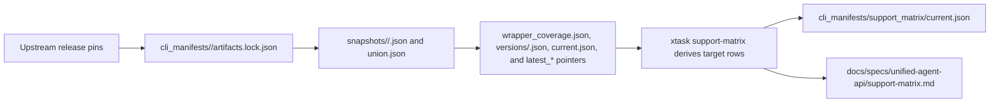
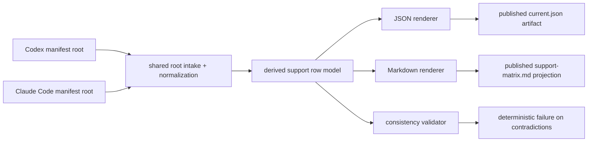
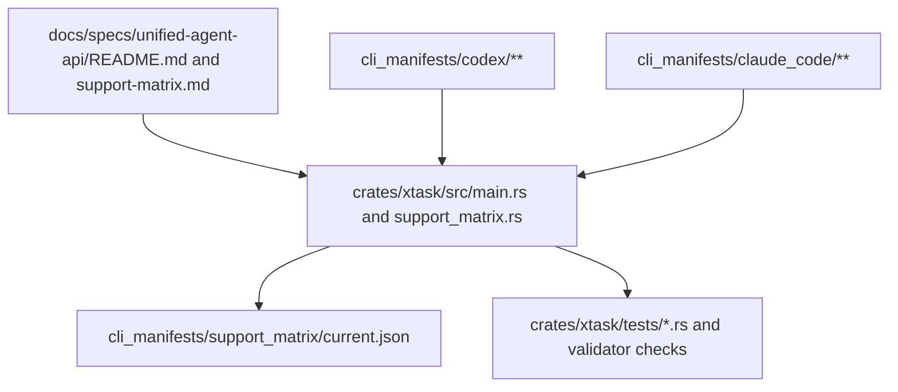

# Review Surfaces - CLI manifest support matrix

These diagrams orient the pack. They show the actual artifact and data flow expected to land for the feature.
They do not, by themselves, satisfy seam-local pre-exec review.
Active and next seams still require seam-local `review.md` later.

## R1 - Support publication workflow

## R2 - Evidence to validation flow

## R3 - Touch surface map

