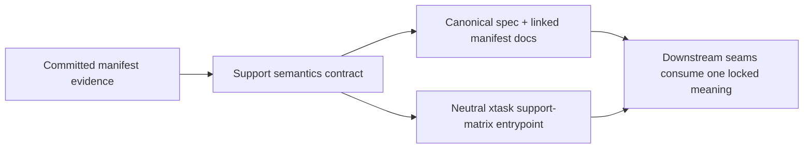
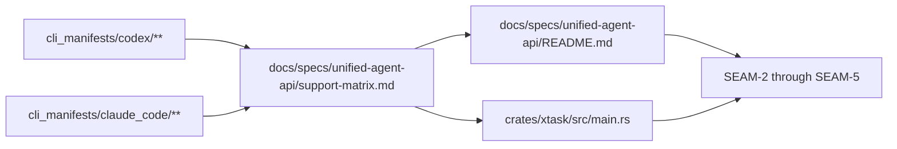

# Review Bundle - SEAM-1 Support semantics and publication contract

This artifact feeds `gates.pre_exec.review`.
`../../review_surfaces.md` is pack orientation only.

## Falsification questions

- Can the repo still treat `versions/<version>.json.status` or `latest_validated.txt` as published support truth after this seam lands?
- Can a downstream seam infer support semantics from manifest prose or validator docs without the canonical support-matrix spec existing and being linked from the UAA spec index?
- Can `xtask` ship a support publication command name or output path that contradicts the canonical doc surfaces pinned by this seam?

## R1 - Support publication workflow

## R2 - Repo touch-surface flow

## Likely mismatch hotspots

- `docs/specs/unified-agent-api/support-matrix.md` does not exist yet even though the pack names it as the canonical contract surface.
- `crates/xtask/src/main.rs` still exposes capability-matrix commands only; no neutral `support-matrix` subcommand exists yet.
- Manifest READMEs and validator/runbook prose already distinguish `validated` and `supported`, but they do so without one repo-wide canonical support publication spec to anchor downstream behavior.

## Pre-exec findings

- No remediation opened. The identified gaps are the intended owned delivery scope of this seam, and the slice plan assigns each mismatch to a concrete execution unit.

## Pre-exec gate disposition

- **Review gate**: passed
- **Contract gate concerns**: resolved in planning by reserving `S00` for the owned support-publication contract, including exact publication surfaces, layer semantics, and verification notes before downstream implementation begins.
- **Revalidation prerequisites**: none upstream; re-check the listed touch surfaces against current repo state at execution start to confirm the same gaps still exist and no conflicting support spec has landed.
- **Opened remediations**: none

## Planned seam-exit gate focus

- **What must be true before downstream promotion is legal**: the support-layer vocabulary is locked in the canonical spec, manifest docs no longer contradict it, and `xtask support-matrix` is the documented command contract for downstream generator work.
- **Which outbound contracts/threads matter most**: `C-01` and `THR-01`
- **Which review-surface deltas would force downstream revalidation**: renamed support layers, changed publication targets, or any shift back toward treating workflow status as published support truth
