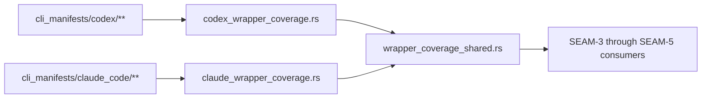
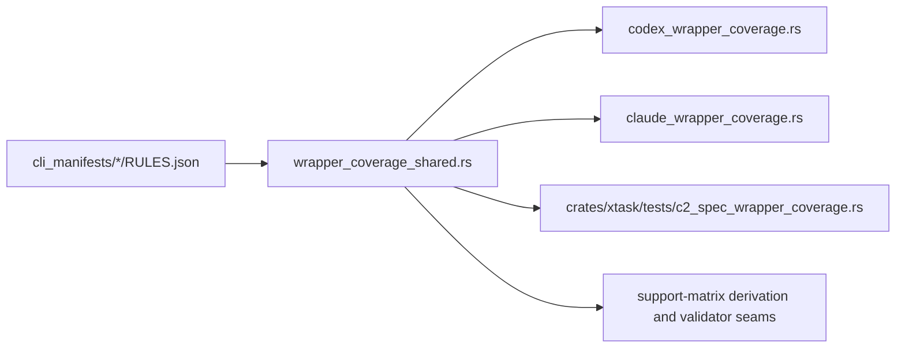

# Review Bundle - SEAM-2 Shared wrapper normalization and agent-root intake

This artifact feeds `gates.pre_exec.review`.
`../../review_surfaces.md` remains pack orientation only.

## Falsification questions

- Can the planned shared seam still hide Codex- or Claude-specific assumptions inside the normalization rules or root-intake contract?
- Can downstream publication work proceed without one neutral contract for versions, pointers, current metadata, and coverage-report intake across both manifest roots?
- Can `crates/xtask/src/codex_wrapper_coverage.rs` and `crates/xtask/src/claude_wrapper_coverage.rs` keep duplicated normalization logic after this seam lands?

## R1 - Shared normalization flow

## R2 - Touch-surface map

## Likely mismatch hotspots

- `crates/xtask/src/codex_wrapper_coverage.rs` and `crates/xtask/src/claude_wrapper_coverage.rs` still duplicate rules parsing, platform inversion, normalization, and sorting helpers.
- The repo does not yet expose one neutral root-intake contract for versions, pointers, current metadata, and coverage reports that future `support-matrix` work can reuse.
- The reserved `xtask support-matrix` entrypoint from `SEAM-1` is now current, but the shared seam it depends on does not exist yet.

## Pre-exec findings

- No remediation opened. `SEAM-1` closeout has landed and `THR-01` is current, so the remaining gaps are the intended owned delivery scope of this seam.

## Pre-exec gate disposition

- **Review gate**: passed
- **Contract gate concerns**: resolved in planning by reserving `S00` for the shared-vs-adapter ownership boundary and the neutral root-intake contract before extraction starts.
- **Revalidation prerequisites**: consume `../../governance/seam-1-closeout.md`, treat `THR-01` as revalidated, and re-check the duplicated normalization helpers plus root-intake assumptions against the current repo state at execution start.
- **Opened remediations**: none

## Planned seam-exit gate focus

- **What must be true before downstream promotion is legal**: the shared module is landed, Codex and Claude adapters are thin, the neutral root-intake contract is explicit, and `THR-02` is publishable without reopening `SEAM-1` semantics.
- **Which outbound contracts/threads matter most**: `C-02`, `C-03`, and `THR-02`
- **Which review-surface deltas would force downstream revalidation**: any change to the shared-vs-adapter split, root-intake shape, or future-agent-shaped neutrality assumptions
