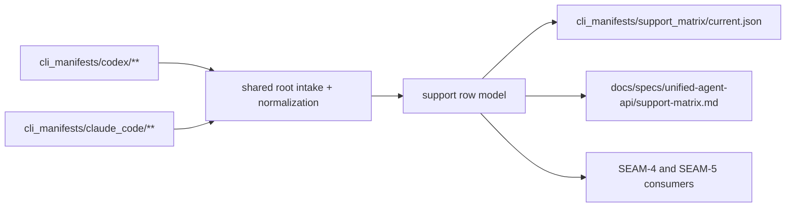
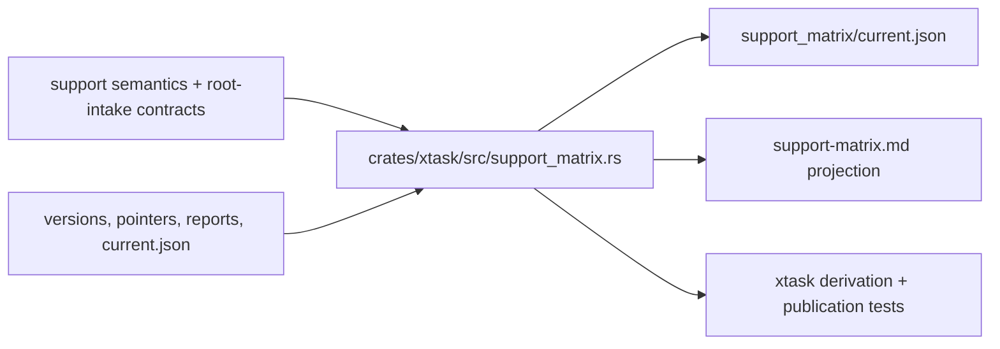

# Review Bundle - SEAM-3 Support-matrix derivation and publication

This artifact feeds `gates.pre_exec.review`.
`../../review_surfaces.md` remains pack orientation only.

## Falsification questions

- Can the planned row model still collapse partial target truth into a version-global support claim?
- Can JSON and Markdown publication drift because they do not consume the same derived model?
- Can the support-matrix seam still leak Codex- or Claude-specific assumptions instead of consuming the neutral root-intake handoff from `SEAM-2`?

## R1 - Support-matrix derivation flow

## R2 - Touch-surface map

## Likely mismatch hotspots

- `crates/xtask/src/support_matrix.rs` is still a reserved stub even though `SEAM-2` has now landed the shared normalization and root-intake handoff it depends on.
- The repo still lacks one concrete row-model contract for field names, ordering, and evidence-note rules that both publication and validation seams can consume.
- `docs/specs/unified-agent-api/support-matrix.md` is currently the canonical semantics contract and later becomes a Markdown projection target, so the seam must make the projection boundary explicit instead of letting the doc become a second truth source.

## Pre-exec findings

- No remediation opened. `SEAM-1` and `SEAM-2` closeouts are now landed, `THR-01` and `THR-02` are current inputs, and the remaining gaps are the intended owned delivery scope of this seam.

## Pre-exec gate disposition

- **Review gate**: passed
- **Contract gate concerns**: resolved in planning by reserving `S00` for the row-model and Markdown-projection contract boundary before implementation begins.
- **Revalidation prerequisites**: consume `../../governance/seam-1-closeout.md` and `../../governance/seam-2-closeout.md`, treat `THR-01` and `THR-02` as revalidated inputs, and re-check the support-matrix row-model against the landed root-intake contract at execution start.
- **Opened remediations**: none

## Planned seam-exit gate focus

- **What must be true before downstream promotion is legal**: the row model is landed, JSON and Markdown render from the same derived source, and `THR-03` is publishable without reopening `SEAM-1` or `SEAM-2`.
- **Which outbound contracts/threads matter most**: `C-04`, `C-05`, and `THR-03`
- **Which review-surface deltas would force downstream revalidation**: any change to row fields, ordering, evidence-note rules, projection ownership, or support-matrix publication paths
