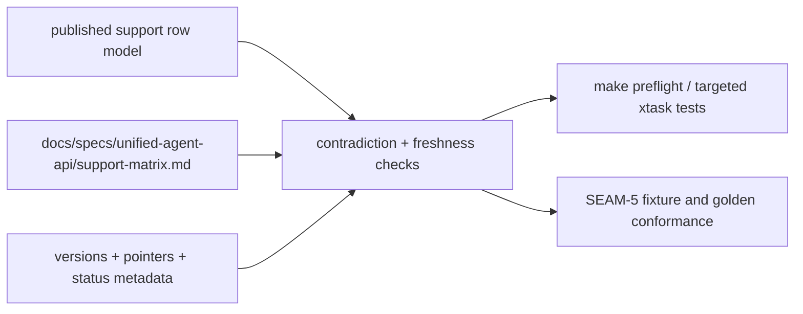
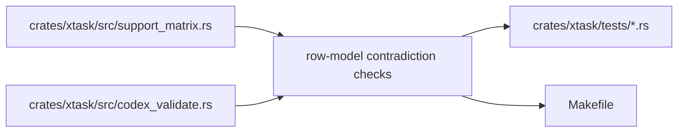

# Review Bundle - SEAM-4 Consistency validation and repo-gate enforcement

This artifact feeds `gates.pre_exec.review`.
`../../review_surfaces.md` remains pack orientation only.

## Falsification questions

- Can the validator seam re-derive support truth instead of consuming the landed row model from `SEAM-3`?
- Can Markdown drift from `cli_manifests/support_matrix/current.json` without deterministic failure?
- Can the repo gate remain ambiguous enough that support-matrix freshness becomes optional reviewer judgment instead of routine automation?

## R1 - Validation flow

## R2 - Touch-surface map

## Likely mismatch hotspots

- `SEAM-3` now publishes the row model and the hybrid Markdown projection, so `SEAM-4` must consume that model directly instead of inventing a validator-only copy.
- Pointer promotion, version metadata, and published support rows can still disagree silently because the repo currently publishes support truth without contradiction enforcement.
- The support-matrix command is now real, but repo-gate participation is still implicit rather than owned.

## Pre-exec findings

- No remediation opened. `SEAM-3` closeout is passed and names `C-04`, `C-05`, and `THR-03` concretely, so the validator seam can treat the published row model as current input.

## Pre-exec gate disposition

- **Review gate**: passed
- **Contract gate concerns**: resolved in planning by keeping contradiction checks downstream of the published row model rather than reopening `SEAM-3` ownership.
- **Revalidation prerequisites**: consume `../../governance/seam-3-closeout.md`, treat `THR-03` as revalidated input, and keep any Markdown freshness rule tied to the same generated block strategy landed in `SEAM-3`.
- **Opened remediations**: none

## Planned seam-exit gate focus

- **What must be true before downstream promotion is legal**: contradiction behavior is deterministic, Markdown freshness is enforced against the same row model, and repo-gate participation is explicit enough for `SEAM-5` to trust routine enforcement boundaries.
- **Which outbound contracts/threads matter most**: `C-06` and `THR-04`
- **Which review-surface deltas would force downstream revalidation**: contradiction classes, repo-gate coupling, Markdown freshness ownership, or any validator move that forks away from the shared row model
