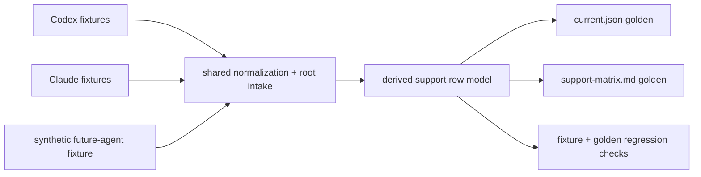
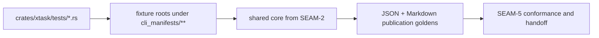

# Review Bundle - SEAM-5 Neutral fixture and golden conformance

This artifact feeds `gates.pre_exec.review`.
`../../review_surfaces.md` remains pack orientation only.

## Falsification questions

- Can the fixture matrix still hide agent-name branching in the shared core?
- Can JSON and Markdown goldens drift from the same derived model without failing deterministically?
- Can a synthetic future-agent-shaped root be special-cased instead of passing through the same neutral path as Codex and Claude?

## R1 - Neutral fixture flow

## R2 - Touch-surface map

## Likely mismatch hotspots

- The shared core must stay shape-driven, not agent-name-driven, or future-agent onboarding will inherit hard-coded assumptions.
- JSON and Markdown both need to stay projections of the same row model so a stale golden cannot drift in only one surface.
- The fixture matrix must cover "not attempted", "unsupported", and "intentionally partial" states or the regression proof will be too narrow.

## Pre-exec findings

- No remediation opened. `SEAM-4` closeout is passed and names `C-06` and `THR-04` concretely, so the fixture seam can treat the contradiction contract as current input.

## Pre-exec gate disposition

- **Review gate**: passed
- **Contract gate concerns**: resolved by keeping neutrality and golden ownership downstream of the landed contradiction contract rather than reopening `SEAM-4`
- **Revalidation prerequisites**: consume `../../governance/seam-4-closeout.md`, treat `THR-04` as revalidated input, and keep the fixture matrix aligned to the same shared model used by publication and validation
- **Opened remediations**: none

## Planned seam-exit gate focus

- **What must be true before downstream promotion is legal**: Codex, Claude, and synthetic fixtures all pass through the same neutral core; goldens stay model-derived; and future-agent coverage remains routine rather than one-off
- **Which outbound contracts/threads matter most**: `C-07` and `THR-05`
- **Which review-surface deltas would force downstream revalidation**: agent-name branching, fixture shape drift, golden ordering changes, or any publication path that stops consuming the shared model
